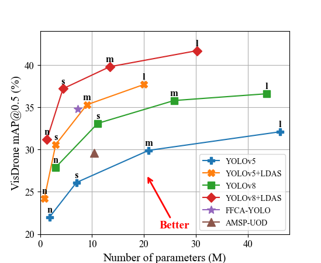

# A Parameter-Lightweight Dynamic Aggregation Strategy for Small Object Detection

<div align=center>

</div>


## <div align="center">Documentation</div>

### Benchmark
| **Model**     | **Datasets** |  **mAP@0.5<sup>val**  | **mAP@0.5:0.95<sup>val** | **Params** | **Weight**                                                                                           |
|:-------------:|:------------:|:---------------------:|:------------------------:|:----------:|:----------------------------------------------------------------------------------------------------:|
| YOLOv8l       | VisDrone     |         36.6%         |          21.6%           | 43.6M      | [Google Drive](https://drive.google.com/drive/folders/1SgVbEPYPvA-S9UQpOUa5tlJjzVBIdEkF?usp=sharing) |
| YOLOv8l+LDAS  | VisDrone     |         41.7%         |          24.5%           | 30.2M      | [Google Drive](https://drive.google.com/drive/folders/1SgVbEPYPvA-S9UQpOUa5tlJjzVBIdEkF?usp=sharing) |
| YOLOv8l       | BDD100K      |         58.6%         |          34.7%           | 43.6M      | [Google Drive](https://drive.google.com/drive/folders/1SgVbEPYPvA-S9UQpOUa5tlJjzVBIdEkF?usp=sharing) |
| YOLOv8l+LDAS  | BDD100K      |         61.7%         |          36.8%           | 29.7M      | [Google Drive](https://drive.google.com/drive/folders/1SgVbEPYPvA-S9UQpOUa5tlJjzVBIdEkF?usp=sharing) |
| YOLOv8l       | TT100K       |         89.9%         |          70.1%           | 43.6M      | [Google Drive](https://drive.google.com/drive/folders/1SgVbEPYPvA-S9UQpOUa5tlJjzVBIdEkF?usp=sharing) |
| YOLOv8l+LDAS  | TT100K       |         95.0%         |          74.6%           | 29.9M      | [Google Drive](https://drive.google.com/drive/folders/1SgVbEPYPvA-S9UQpOUa5tlJjzVBIdEkF?usp=sharing) |

Table Notes
- No pre-trained weights were used during training.
- The input image resolution is 640×640.
- The training batch size is 16, with a total of 300 training epochs.
- All other parameters follow the settings of the baseline model.

### Quick Start
<details open>
<summary>Install</summary>

Clone repository and install [requirements.txt](./requirements.txt) in a [**Python==3.10**](https://www.python.org/) environment, 
including [**PyTorch==2.0.1**](https://pytorch.org/get-started/previous-versions/) and [**CUDA==11.7**](https://pytorch.org/get-started/previous-versions/).
```bash
git clone https://github.com/Anonymous2Author2/LDAS.git  # Clone the LDAS repository
cd LDAS  # Navigate to the cloned directory
pip install -e .  # Install the package in editable mode for development
```
</details>

<details open>
<summary>Training</summary>
The commands below reproduce LDAS training results.

```bash
yolo task=detect mode=train model=yolov8l+LDAS.yaml data=VisDrone.yaml epochs=300 batch=16 device=0
```
</details>

<details open>
<summary>Evaluation</summary>
The commands below reproduce LDAS evaluation results.

```bash
yolo task=detect mode=val model=weights/best.pt data=VisDrone.yaml batch=16 device=0
```
</details>

<details open>
<summary>Inference</summary>

The commands below reproduce LDAS inference results.

```bash
yolo task=detect mode=predict model=weights/best.pt device=0 source=path/to/image.jpg  # image
                                                                    path/to/video.mp4  # video
                                                                    path/to/dir  # directory
```
</details>

### Implementation details
Please note
- The overall architecture of LDAS is located at `LDAS/ultralytics/models/v8/yolov8+LDAS.yaml`.
- The DAM module is located at `LDAS/ultralytics/nn/modules.py` and calls `LDAS/ultralytics/nn/DAM.py`.
- The dataset paths in `LDAS/ultralytics/nn/DAM.py` and `LDAS/ultralytics/datasets/` need to be changed to the root directory where the datasets are stored.
- The configuration file is located at `LDAS/ultralytics/yolo/cfg/default.yaml`.
- Representative images of small objects are located at `LDAS/ultralytics/assets/small_object/`.

### Data download
Note that all data has been cleaned and converted to YOLO format labels.
- VisDrone (1.81 GB): [GoogleDrive](https://drive.google.com/file/d/1TSN5Jb63aoJrv6riQTkBGNcdRrwWdwHV/view?usp=sharing)
- BDD100K (4.25 GB): [GoogleDrive](https://drive.google.com/file/d/1mRu280F9i4gNzFbFoONDxK3hCZlOB2__/view?usp=sharing)
- TT100K (8.74 GB): [GoogleDrive](https://drive.google.com/file/d/18xjqTSzsfEFaUeYsjCbZtQhBHhspMjWJ/view?usp=sharing)

## Acknowledgement
The code implementation is based on [YOLOv8](https://github.com/ultralytics/ultralytics), thanks to their open-source code.
The data is based on the [VisDrone](https://github.com/VisDrone/VisDrone-Dataset), [BDD100K](https://www.vis.xyz/bdd100k/), and [TT100K](https://cg.cs.tsinghua.edu.cn/traffic-sign/) datasets, thanks to their open-source data.